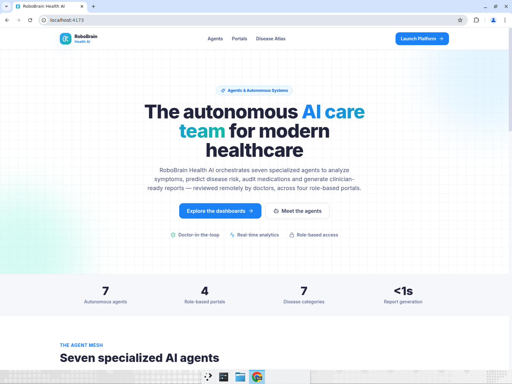
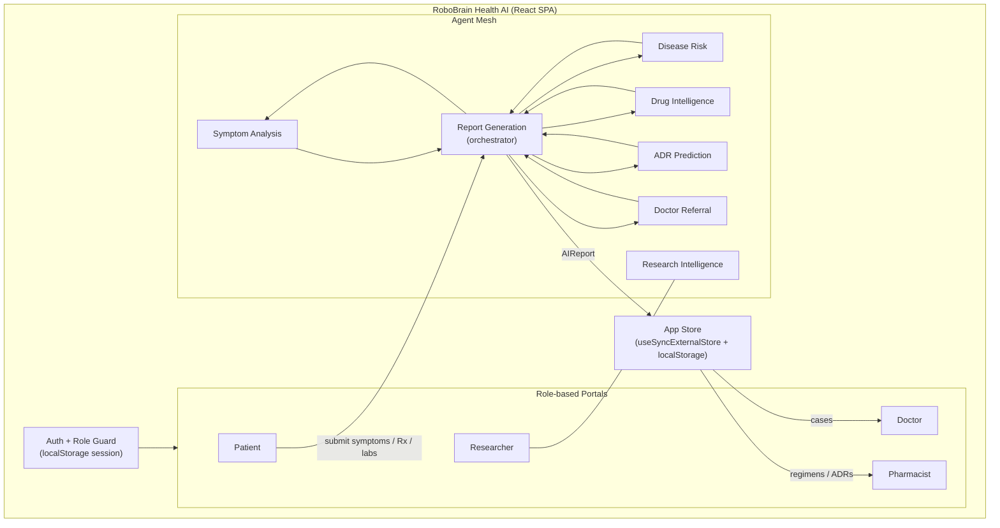
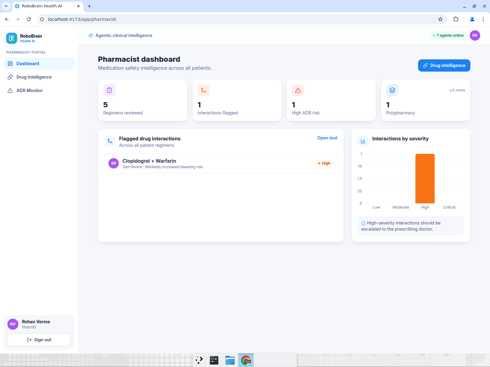
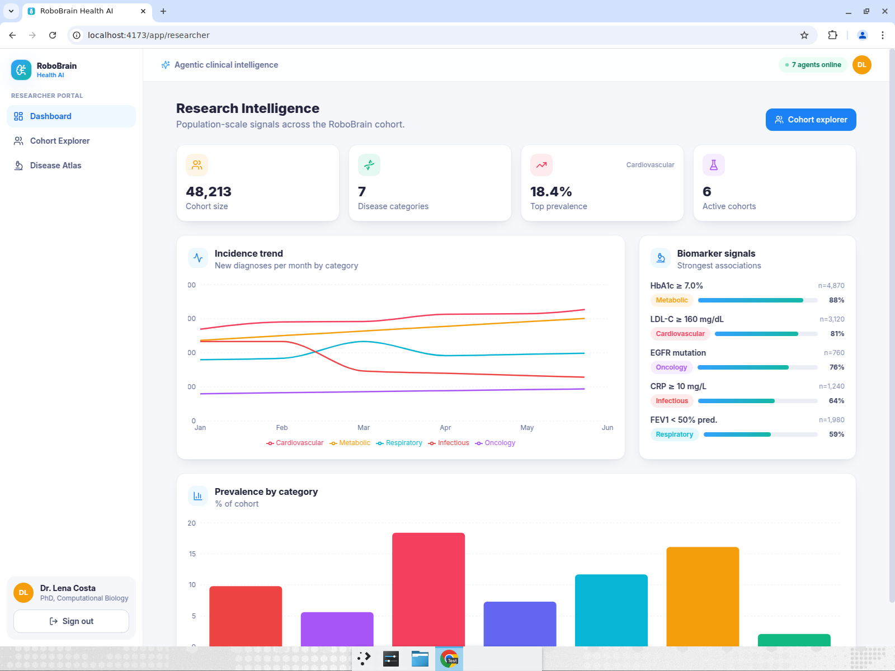

# 🧠 RoboBrain Health AI

> An **agentic & autonomous** healthcare platform — seven specialized AI agents that analyze symptoms, predict disease risk, audit medications and generate clinician-ready reports across four role-based portals, with a **doctor always in the loop**.

<p align="center">
  
</p>

<p align="center">
  <em>React • TypeScript • Tailwind CSS • Vite • Recharts</em>
</p>

---

## ✨ Overview

RoboBrain Health AI is a modern, responsive healthcare web platform built around an **agent mesh**: a set of cooperating AI agents, each owning a single clinical task, orchestrated into one explainable assessment.

Patients upload **symptoms, prescriptions and lab reports** and instantly receive an **AI-generated report**. That report is routed for **remote review** by a doctor, audited for drug safety by a pharmacist, and aggregated into population-level signals for researchers — all from the same engine.

> ⚕️ **Disclaimer:** This is a demonstration project for a hackathon. It provides decision support only and is **not** a medical device or a substitute for professional medical advice. All data is synthetic.

---

## 🚀 Key Features

- **Four role-based portals** — Patient, Doctor, Pharmacist, Researcher — each with a tailored dashboard.
- **Seven autonomous AI agents** with a clean, swappable inference interface.
- **Role-based authentication** with one-click demo login for every role.
- **AI report pipeline** — watch the agent mesh run live, then read a clinician-ready report.
- **Doctor-in-the-loop review** — confirm, modify or escalate every AI assessment.
- **Rich analytics** — radar, area, line, bar and donut charts powered by Recharts.
- **Seven disease categories** mapped across every finding.
- **Fully responsive** — works from mobile to widescreen.
- **Zero backend required** — runs entirely in the browser with `localStorage` persistence.

---

## 🤖 The Agent Mesh

| Agent | Responsibility |
|-------|----------------|
| 🩺 **Symptom Analysis Agent** | Parses free-text symptoms into ranked differential diagnoses with confidence scores. |
| 🛡️ **Disease Risk Agent** | Computes multi-category disease risk from vitals, history and lifestyle signals. |
| 💊 **Drug Intelligence Agent** | Reviews prescriptions for interactions, dosing notes and alternatives. |
| ⚠️ **ADR Prediction Agent** | Predicts adverse drug reactions and recommends monitoring plans. |
| ➕ **Doctor Referral Agent** | Routes cases to the right specialty with an urgency level and suggested tests. |
| 📄 **Report Generation Agent** | Orchestrates the other agents into a single, explainable report with an execution trace. |
| 🔬 **Research Intelligence Agent** | Surfaces cohort trends, biomarkers and signals across the population dataset. |

Every agent implements a common `Agent<Input, Output>` interface. Today they run as **deterministic, explainable inference engines** in the browser (no API keys, no network) — and the same interface can be backed by an LLM or clinical API later.

```ts
export interface Agent<I, O> {
  id: string
  name: string
  model: string
  run(input: I): O
}
```

---

## 👥 Portals & Disease Atlas

| Portal | Highlights |
|--------|-----------|
| **Patient** | Upload symptoms/prescriptions/labs, live agent run, AI reports, editable health profile with real-time risk recompute. |
| **Doctor** | Prioritized review queue, full report view, sign-off (agree / modify / escalate), clinical analytics. |
| **Pharmacist** | Cross-patient drug-interaction feed, interactive regimen builder, ADR watchlist. |
| **Researcher** | Population incidence trends, biomarker signals, cohort explorer, disease atlas. |

**Disease categories:** Infectious Diseases · Cancer & Oncology · Cardiovascular Disorders · Neurological Disorders · Respiratory Disorders · Metabolic & Endocrine Disorders · Genetic & Rare Disorders.

---

## 🏗️ Architecture



**Data flow:** a patient submission is sent to the **Report Generation Agent**, which fans out to the other agents, collects their structured outputs (plus an execution trace), and writes a single `AIReport` into the shared store. The doctor, pharmacist and researcher portals all read from that same store, so a new submission appears in the doctor's queue immediately.

---

## 🛠️ Tech Stack

- **React 18** + **TypeScript** (strict)
- **Vite 5** build tooling
- **Tailwind CSS 3** for styling
- **React Router 6** for role-based routing
- **Recharts** for analytics & charts
- **lucide-react** icons
- **ESLint** + `tsc` for quality gates

---

## ⚡ Getting Started

### Prerequisites
- **Node.js ≥ 20** and npm

### Install & run

```bash
# 1. Clone
git clone <your-repo-url>
cd robobrain-health-ai

# 2. Install dependencies
npm install

# 3. Start the dev server
npm run dev
# → http://localhost:5173
```

### Other scripts

```bash
npm run build       # type-check + production build to dist/
npm run preview     # preview the production build
npm run lint        # ESLint
npm run typecheck   # TypeScript type-check (no emit)
```

### 🔑 Demo accounts

Use **one-click demo login** on the sign-in page, or sign in manually (password `demo1234` for all):

| Role | Email |
|------|-------|
| Patient | `patient@robobrain.ai` |
| Doctor | `doctor@robobrain.ai` |
| Pharmacist | `pharmacist@robobrain.ai` |
| Researcher | `researcher@robobrain.ai` |

---

## 📸 Screenshots

| Patient — AI Report | Live Agent Run |
|---|---|
|  |  |

| Doctor — Review Queue | Pharmacist — Drug Safety |
|---|---|
|  |  |

| Researcher — Population Intelligence | Role-based Login |
|---|---|
|  |  |

---

## 📁 Project Structure

```
src/
├── App.tsx                 # Routes + role guards
├── context/AuthContext.tsx # Auth state (localStorage session)
├── lib/
│   ├── agents.ts           # The 7 AI agents + report orchestration
│   ├── data.ts             # Disease categories, demo users, seed cases
│   ├── research.ts         # Synthetic population dataset
│   ├── store.ts            # App store (cases, profile)
│   └── roles.ts, format.ts # Helpers
├── components/             # Layout, ReportView, charts, UI primitives
└── portals/
    ├── patient/            # Dashboard, New Submission, Reports, Profile
    ├── doctor/             # Dashboard, Review Queue, Analytics
    ├── pharmacist/         # Dashboard, Drug Intelligence, ADR Monitor
    └── researcher/         # Dashboard, Cohort Explorer, Disease Atlas
```

---

## 🔌 Extending the agents (LLM-ready)

Each agent is a pure function behind the `Agent` interface. To plug in a real model, implement an inference provider and swap the agent body — the UI, types and report pipeline stay unchanged. See `src/lib/agents.ts` (`InferenceProvider`, `LOCAL_PROVIDER`).

---

## 📝 License

Built for a hackathon under the theme **Agentic & Autonomous Systems**. Synthetic data only — not for clinical use.
